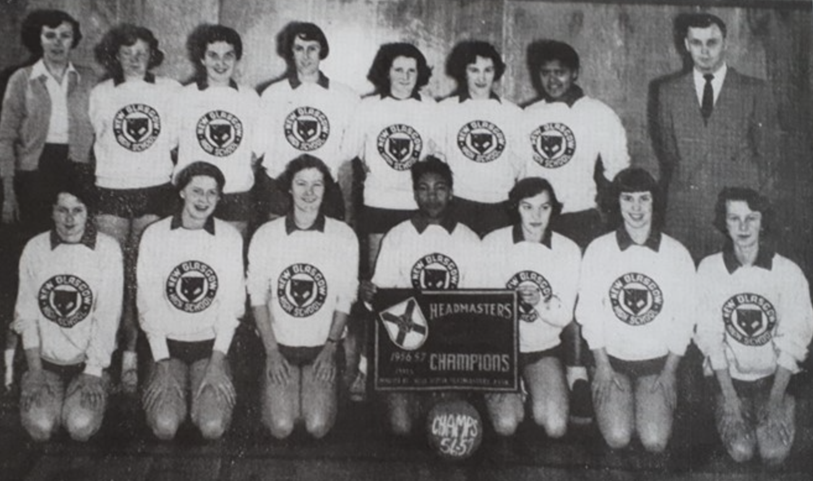

# Early Tides in Nova Scotia: Canada's First High School Girls' Soccer League

&nbsp;&nbsp;&nbsp;&nbsp;&nbsp;&nbsp;It was a cold November day in 1956 and the girls from New Glasgow High School were getting ready for their championship soccer match. The team had been put together just one year before. The championship game was taking place at Wanderers Grounds in Halifax, Nova Scotia, and the girls were both excited and nervous for the match.

&nbsp;&nbsp;&nbsp;&nbsp;&nbsp;&nbsp;As the game kicked off, so did the storm. Spectators retreated to their cars while the girls kept playing. By the end of the match, the girls were knee deep in snow. They were wearing only their school gym uniforms, with no sweaters, no gloves, and no toques – it was a frigid game. But the New Glasgow girls came out on top, defeating Lockeport High School in a 6-0 rout¹.

The New Glasgow High School girls' soccer team. Source: New Glasgow High School 1957 Yearbook

&nbsp;&nbsp;&nbsp;&nbsp;&nbsp;&nbsp;It wasn’t until the 1970s that girls’ and women’s soccer started gaining popularity in Canada². The high school league in Nova Scotia was one of the earliest girls’ soccer programs across the country, though not the earliest. Girls were also starting teams in Quebec in the mid 1940s and Ontario as early as the mid 1930s³&#722;⁴. Even so, competition for those teams was hard to come by. The first women’s university team at McGill, formed in 1950, played against only a few other teams, and only one local university team. Their other matches were played against high school teams and the Vermont Teachers College⁵. Despite the existence of these early teams, the majority of them were not part of a proper league due to a lack of competition⁶. 

&nbsp;&nbsp;&nbsp;&nbsp;&nbsp;&nbsp;The league in Nova Scotia, however, known as the Headmasters’ League, was different. It included 6 teams, making up a proper league with a proper championship tournament. While earlier teams were formed, it’s the earliest proper high school or university league known to have existed in Canada.

&nbsp;&nbsp;&nbsp;&nbsp;&nbsp;&nbsp;The Nova Scotia Headmasters’ Association may be to thank for such an early girls' soccer league. The association was formed in the 1930s as an informal group of school principals who came together to discuss educational issues. The need for organized sport was identified as a top concern, which led to a rapidly expanding menu of interscholastic sports. Without the association’s ability and will to organize across schools, a proper girls soccer league may have taken decades longer to be formed. Eventually, the Athletic Committee of the Headmasters’ Association was replaced by the Nova Scotia School Athletic Federation, who still oversees interscholastic sport today⁷.

&nbsp;&nbsp;&nbsp;&nbsp;&nbsp;&nbsp;Mary Sproull Pomery, one of the girls on that 1956 championship team, is still friends with many of her 1956 teammates. They were a team that stuck together, especially in the lowest moments. As Mary remembers it, following their championship win, the team went out to celebrate at a nearby restaurant, whose manager refused to serve the Black girls on the team. The whole team got up together and left. 

&nbsp;&nbsp;&nbsp;&nbsp;&nbsp;&nbsp;Mary was also an avid figure skater, and would sign up for any sport she could. She went on to attend Dalhousie University, who unfortunately had no women’s soccer at the time. She taught skating to kids for a while, and continued skating up until she was 80.

&nbsp;&nbsp;&nbsp;&nbsp;&nbsp;&nbsp;The same year Mary and her friends were crowned soccer champions, the girls basketball and boys rugby teams also won championships for the school. It was an exciting year to be at New Glasgow High, and the whole school became increasingly excited about sports. According to Mary, everyone now wanted to play. Their success helped start the momentum for younger kids to get involved and believe that they too could be champions.

## Footnotes

¹Mary Sproull Pomery, interview by author, phone recording, September 28, 2024.

²M. Ann Hall, “The Game of Choice: Girls’ and Women’s Soccer in Canada,” essay, in Soccer, Women, Sexual Liberation: Kicking Off a New Era (Taylor & Francis, 2004).

³Colin Jose, “Soccer,” The Canadian Encyclopedia, August 8, 2012, https://www.thecanadianencyclopedia.ca/en/article/soccer.

⁴“Stanstead College Annual: June 1945,” Internet Archive, accessed 2024, https://archive.org/details/Spectrum1945.

⁵Stu Cowan, “Women’s Soccer Has Come Long Way since McGill’s First Team in 1950,” Montreal Gazette, 2020, https://www.google.com/url?q=https://montrealgazette.com/sports/soccer/international-soccer/stu-cowan-womens-soccer-has-come-long-way-since-mcgills-first-team-in-1950.

⁶There is one [newspaper reference](https://numerique.banq.qc.ca/patrimoine/details/52327/2996188?docsearchtext=%22girls%20soccer%22) to a women's league being formed in Winnipeg in 1948, but to date, I have not been able to find any additional information on this league apart from a quote referencing its existence in the Sherbrooke Daily Record.

⁷Nova Scotia School Athletic Federation Handbook: 2019-2020, 2019, https://docs.google.com/document/d/1mWdj4C5u6z-W1QvZpOU5bOyGHmWlMvC9atxBLJYVz9I.

---

Published: January 19, 2025  
Updated: January 19, 2025